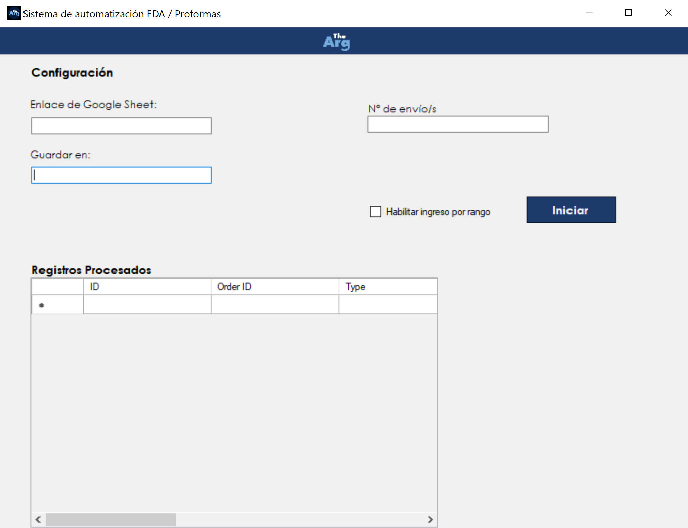

# Instructivo para el uso del Sistema Automatizador de FDA y Proformas
Este instuctivo tiene como fin capacitar al usuario en el uso del sistema automatizador de FDA y Proformas.
  
  
## Que realiza el sistema?
El sistema se encarga de completar y descargar los formularios de FDA y las Proformas de manera automática. Indicando un link de google sheet y un número de envío (o varios, o un rango desde - hasta), el sistema tomará como referencia estos datos proporcionados para buscar los campos (celdas) que esten relacionados a este/estos número/s de envío y poder utilizarlos para realizar el proceso de forma automática. 
Una vez terminado el proceso, el sistema guardará las descargas del FDA y la Proforma en una carpeta que tendrá como nombre el número de envío relacionado a estos archivos. Puede ya existir esta carpeta o no (si no existe, el sistema la crea automaticamente)
  
  
## Interfaz de usuario

En la interfaz vamos a encontrar distintos inputs que el usuario deberá completar. A continuacion, pasamos a explicar que dato se debe ingresar en cada uno:

### Enlace de google sheet:
En este espacio, el usuario deberá indicar el link del google sheet en donde se encuentren los datos para realizar el proceso para completar y descargar los formularios de FDA y Proformas.

### Guardar en:
Clickeando en este espacio, se abrirá el explorador de archivos para que el usuario pueda indicar la ruta en la que se guardarán las descargas del FDA y Proforma.

### N° de envío:
Acá el usuario deberá indicar el número de envío que se usará como referencia para tomar los datos y realizar el proceso de forma automática. El usuario puede indicar simplemente un número de envío, o puede indicar varios (en caso de ser varios, deberán estar separados por ;)

### Check box 'Habilitar ingreso por rango'

Este check box está pensado para los casos en el que el usuario desee realizar el proceso para un rango de números de envío (ejemplo: 1 - 10). En caso de estar habilitado, se mostrarán 2 espacios para realizar el ingreso de este rango de numeros de envío.
  
  
## Validaciones
El sistema valida que los ingresos sean correctos. A continuación, detallamos algunos errores que pueden surgir:

### Error - URL de google sheet y carpeta de destino sin completar

### Error - N° de envío sin completar

### Error - URL de google sheet inválida

### Error - Rango de envíos sin completar

### Error - N° de envío inicial mayor al N° de envío final

  
  
## Tener en cuenta
1. Al abrir el programa por primera vez, éste se encarga de abrir el navegador y redirigirte al logueo de la página web de FDA. A partir de ahí, lo único que tiene que hacer el usuario de forma manual, es el logueo e ingreso a la web.
  
2. Una vez dentro de la web, si se está inactivo durante unos minutos, la web cierra la sesión del usuario que esté logueado. Si esto sucede, se debe volver a hacer el logueo de forma manual.
  
3. El programa debe correrse SIEMPRE con EL NAVEGADOR ABIERTO. En caso de darle al boton 'Iniciar' y no estar el navegador abierto, el programa tenderá a fallar y requerirá de un reinicio del mismo.
  
4. Antes de dar inicio al proceso, se debe verificar que los datos que se utilizarán para la automatización ESTEN EN EL EXCEL y TENGAN UN FORMATO VÁLIDO. Con estas dos cosas, nos referimos a que los datos que se requieran para completar el FDA, se encuentren en el documento (No puede pasar que hayan celdas con datos faltantes para los envíos que se quieran procesar), y a su vez, se necesita que estos datos tengan el formato adecuado para el ingreso en el FDA.
  
5. Al crear un excel (O 'base de datos') nuevo, se debe compartir el documento con el programa de Automatizacion de FDA utilizando el mail "python-sheets@python-sheets-401219.iam.gserviceaccount.com" y otorgandole permisos de editor. De esta manera el programa podra obtener los registros solicitados, descargar proformas, y escribir fechas en el documento.  
